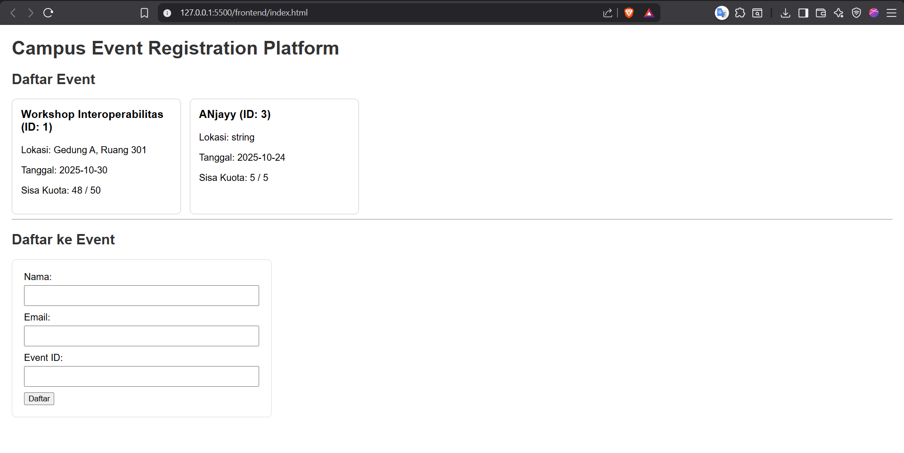

# Proyek UTS Interoperabilitas: Campus Event Registration Platform

Ini adalah proyek untuk memenuhi Ujian Tengah Semester mata kuliah Interoperabilitas.

## Deskripsi Proyek

Sistem ini terdiri dari:

- **Backend:** REST API menggunakan FastAPI (Python)
- **Database:** MySQL
- **Frontend:** HTML + JavaScript (Fetch API)

## Daftar Endpoint API

Endpoint utama ada di `http://127.0.0.1:8000`

- `GET /docs`: Melihat dokumentasi interaktif Swagger UI.
- `GET /events/`: Menampilkan semua event.
- `POST /events/`: Menambah event baru.
- `GET /events/{id}`: Menampilkan satu event spesifik.
- `PUT /events/{id}`: Mengubah data event.
- `DELETE /events/{id}`: Menghapus event.
- `POST /register/`: Mendaftarkan peserta baru ke sebuah event.
- `GET /participants/`: Menampilkan semua peserta yang terdaftar.

## Cara Menjalankan Aplikasi

**1. Backend (Python FastAPI)**

- Masuk ke folder `backend/`
- Buat virtual environment: `python -m venv env`
- Aktifkan: `env\Scripts\activate`
- Install dependencies: `pip install -r requirements.txt`
- Jalankan server: `uvicorn main:app --reload`

**2. Frontend (HTML/JS)**

- Masuk ke folder `frontend/`
- Buka file `index.html` langsung di browser.

## Screenshot Hasil Uji

