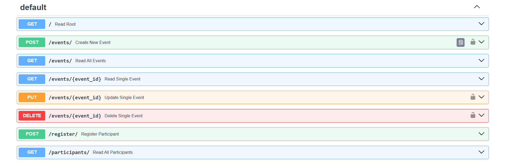
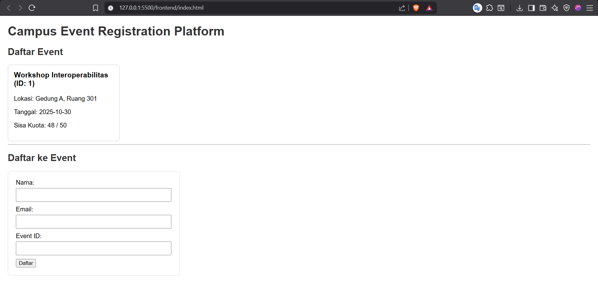

# Proyek UTS: Platform Pendaftaran Event Kampus (Interoperability)

Ini adalah proyek Ujian Tengah Semester untuk mata kuliah Interoperabilitas.

## Deskripsi Proyek

Sistem ini mendemonstrasikan interoperabilitas antara beberapa komponen teknologi yang berbeda untuk membuat aplikasi web fungsional. Arsitektur sistem terdiri dari:

- **Backend REST API:** Dibuat menggunakan **FastAPI (Python)**, bertugas mengelola semua logika bisnis, validasi data, dan komunikasi ke database.
- **Database Relasional:** Menggunakan **MySQL** untuk menyimpan data `events` dan `participants` secara persisten, lengkap dengan relasi _foreign key_.
- **Frontend/Client:** Sebuah aplikasi web statis sederhana menggunakan **HTML, CSS, dan JavaScript (Fetch API)** yang mengonsumsi data dari backend API.

Interoperabilitas dicapai dengan membuat semua komponen "berbicara" satu sama lain menggunakan standar universal (HTTP request) dan format data standar (JSON).

## Teknologi yang Digunakan

- **Backend:** Python 3.10+, FastAPI, SQLAlchemy (ORM), Pydantic
- **Database:** MySQL
- **Frontend:** HTML, CSS, JavaScript (ES6+ Async/Await, Fetch API)
- **Server:** Uvicorn
- **Lainnya:** `fastapi-cors`, `mysql-connector-python`, Git, `.gitignore`

## Fitur Utama

- **Manajemen Event (CRUD):** Admin dapat membuat, membaca, mengubah, dan menghapus data event.
- **Pendaftaran Peserta:** Pengguna publik dapat mendaftarkan diri ke sebuah event melalui _endpoint_ `/register`.
- **Validasi Kuota:** Sistem secara otomatis menolak pendaftaran baru jika kuota event (`quota`) sudah penuh.
- **Relasi Data:** Data peserta terhubung ke data event (relasi _one-to-many_).
- **(Bonus 🔒) Autentikasi Admin:** Endpoint sensitif (membuat, mengubah, menghapus event) diamankan menggunakan Bearer Token.
- **(Bonus 📖) Dokumentasi Otomatis:** Dokumentasi API interaktif (Swagger UI) tersedia otomatis di `/docs`.

## Dokumentasi API (Endpoint)

Dokumentasi interaktif lengkap dapat diakses di `http://127.0.0.1:8000/docs` saat server berjalan.

| Method   | Path                 | Deskripsi                         | Perlu Admin? |
| :------- | :------------------- | :-------------------------------- | :----------- |
| `GET`    | `/events/`           | Melihat semua event & pesertanya. | Tidak        |
| `POST`   | `/events/`           | Membuat event baru.               | **Ya 🔒**    |
| `GET`    | `/events/{event_id}` | Melihat detail 1 event.           | Tidak        |
| `PUT`    | `/events/{event_id}` | Mengubah data 1 event.            | **Ya 🔒**    |
| `DELETE` | `/events/{event_id}` | Menghapus 1 event.                | **Ya 🔒**    |
| `POST`   | `/register/`         | Mendaftarkan peserta baru.        | Tidak        |
| `GET`    | `/participants/`     | Melihat semua peserta.            | Tidak        |

## Cara Menjalankan Aplikasi

Berikut adalah langkah-langkah untuk menjalankan proyek ini di komputermu.

### Prasyarat

- Python 3.10 atau lebih baru
- Git
- Server MySQL (Contoh: XAMPP, Laragon, MySQL Workbench)

---

### Langkah 1: Clone & Setup Database

1.  **Clone Repository**

    ```bash
    git clone [https://github.com/](https://github.com/)yogi-pradnyana/interoperability-final-yogi-pradnyana.git
    cd interoperability-final-yogi-pradnyana
    ```

2.  **Buat Database**

    - Jalankan server MySQL kamu.
    - Buka `phpMyAdmin` atau _tool_ database lainnya.
    - Buat sebuah database baru yang masih kosong. Contoh nama: `uts_interop_db`.

3.  **Struktur Tabel**
    - Aplikasi ini akan **membuat tabel (`events`, `participants`) secara otomatis** saat pertama kali dijalankan (menggunakan SQLAlchemy).
    - _Alternatif:_ Kamu bisa mengimpor struktur dari file `create_db.sql` yang sudah disediakan.

---

### Langkah 2: Backend (FastAPI)

1.  **Masuk ke Folder Backend**

    ```bash
    cd backend
    ```

2.  **Buat & Aktifkan Virtual Environment**

    ```bash
    # Buat venv
    python -m venv env

    # Aktifkan di Windows
    env\Scripts\activate

    # Aktifkan di Mac/Linux
    source env/bin/activate
    ```

3.  **Konfigurasi Database (PENTING!)**

    - Buka file `backend/database.py`.
    - Sesuaikan string `SQLALCHEMY_DATABASE_URL` dengan _username_, _password_, dan _nama database_ MySQL kamu.

    ```python
    # Contoh di backend/database.py
    SQLALCHEMY_DATABASE_URL = "mysql+mysqlconnector://root:@127.0.0.1/uts_interop_db"
    # Format: "mysql+mysqlconnector://<user>:<password>@<host>/<nama_database>"
    ```

4.  **Install Dependencies**

    ```bash
    pip install -r requirements.txt
    ```

5.  **Jalankan Server API**
    ```bash
    uvicorn main:app --reload
    ```
    - Server backend akan berjalan di `http://127.0.0.1:8000`.
    - Biarkan terminal ini tetap berjalan.

---

### Langkah 3: Frontend (HTML/JS)

Pastikan server backend (Langkah 2) sudah berjalan.

1.  Buka _file explorer_ di komputermu.
2.  Masuk ke folder `frontend/`.
3.  **Klik dua kali file `index.html`** untuk membukanya di browser favoritmu (Chrome, Firefox, dll.).
4.  Frontend akan otomatis terhubung ke backend (`http://127.0.0.1:8000`) dan menampilkan data.

<br>

**Metode Alternatif (Menggunakan Live Server)**

Jika metode "klik dua kali" bermasalah atau kamu ingin fitur _auto-reload_ saat _ngoding_:

1.  Buka proyek ini di **VS Code**.
2.  Install ekstensi **"Live Server"** (dari Ritwick Dey).
3.  Di _file sidebar_, klik kanan pada file `frontend/index.html`.
4.  Pilih **"Open with Live Server"**.
5.  Browser akan otomatis terbuka di alamat seperti `http://127.0.0.1:5500`.

## Autentikasi Admin (Bonus)

- Endpoint yang ditandai 🔒 (membuat, mengubah, menghapus event) dilindungi oleh Bearer Token.
- Untuk mengaksesnya (misalnya melalui `/docs`):
  1.  Klik tombol **"Authorize"** di kanan atas.
  2.  Di _pop-up_, masukkan **token rahasia** ke dalam _field_ `Value:`.
  3.  Contoh: `inirahasiaadmin123`
  4.  Klik "Authorize" dan "Close". Sekarang kamu bisa menjalankan _endpoint_ admin.

## Screenshot Hasil Uji




